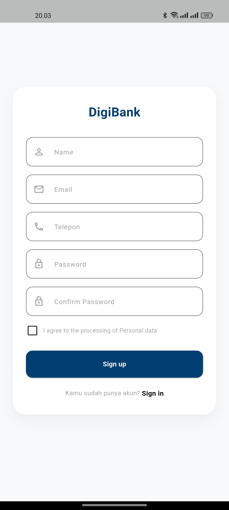
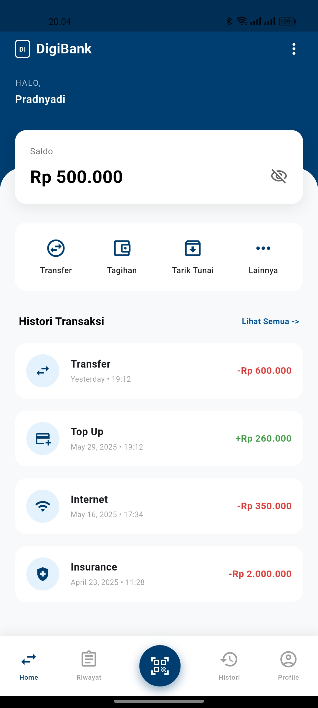
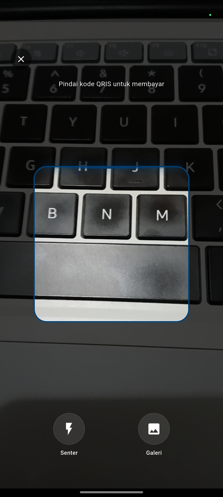
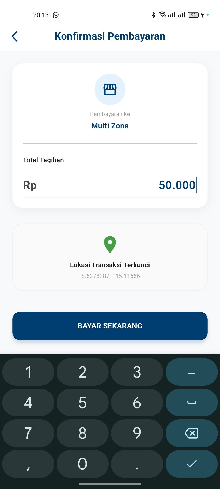
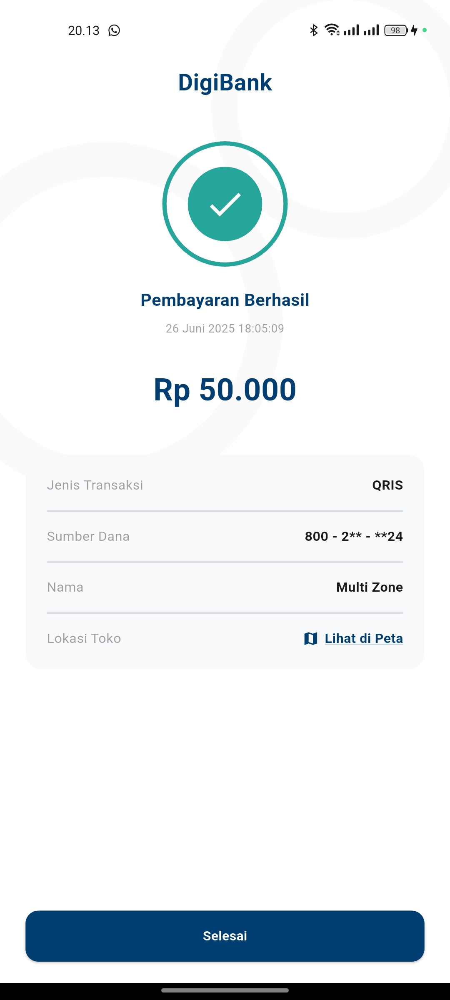

# DigiBank UAS - Sistem Pembayaran QRIS

Aplikasi ini dibuat untuk memenuhi tugas UAS Mata Kuliah Pemrograman Mobile. Aplikasi ini memungkinkan pengguna memindai kode QRIS, mendeteksi lokasi transaksi secara otomatis, dan menampilkan detail pembayaran.

## 👥 Anggota Kelompok
1. Dewa Made Pradnyadi Putra (2301010074)
2. Kadek Ari Surya Wijaya (2301010080)
3. Kadek Deana Putra (2301010087)

## 🔗 Link Desain & Dokumen
- **Desain Figma :** https://www.figma.com/design/Wq0m6JFEoMaBWtPbKcWFju/Untitled?node-id=0-1&t=KmWbShxqjqpfvMuC-1
- **Google Docs - Penjelasan Project :** https://docs.google.com/document/d/1WLFvdRT42Dgiivzoi_f55ScryYTvWs_hxFFHmtXxxfY/edit?usp=sharing

## 📸 Screenshot Implementasi

| Halaman Scan | Halaman Hasil (Sukses) |
| :---: | :---: |
|  |  |
|  |  |
|  | |

## 📱 Fitur Utama
- **QRIS Scanner:** Memindai kode QRIS standar dan membaca data merchant & nominal.
- **Auto Location:** Mendeteksi lokasi pengguna (Jalan, Kecamatan, Kab) saat transaksi menggunakan Geolocation & Geocoding.
- **Validasi Data:** Menangani format QR yang valid dan tidak valid.
- **Bukti Transaksi:** Menampilkan struk digital setelah scan berhasil.

## 🛠️ Teknologi yang Digunakan
- **Framework:** Flutter (Dart)
- **Library:** - `mobile_scanner` (Camera)
  - `geolocator` & `geocoding` (Lokasi)
  - `intl` (Format Rupiah)
